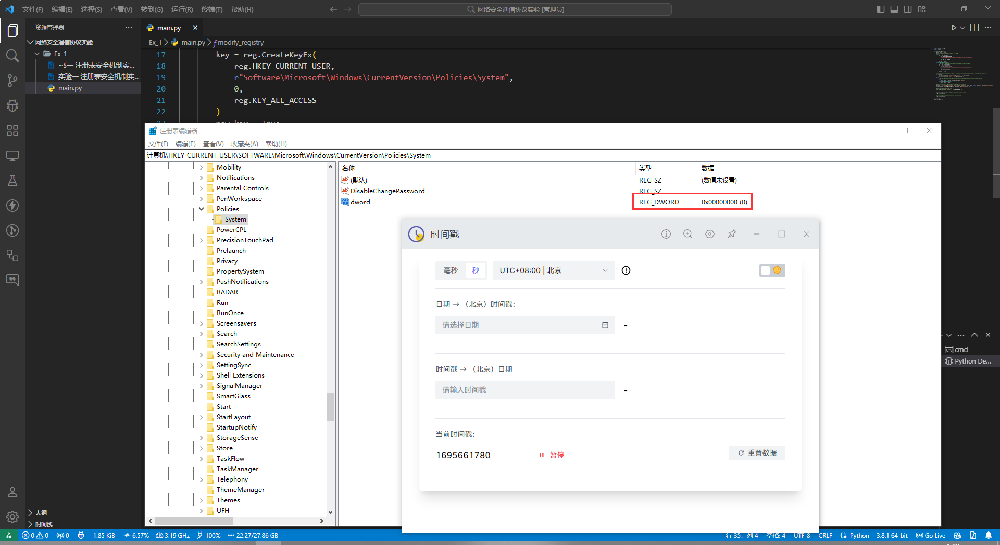
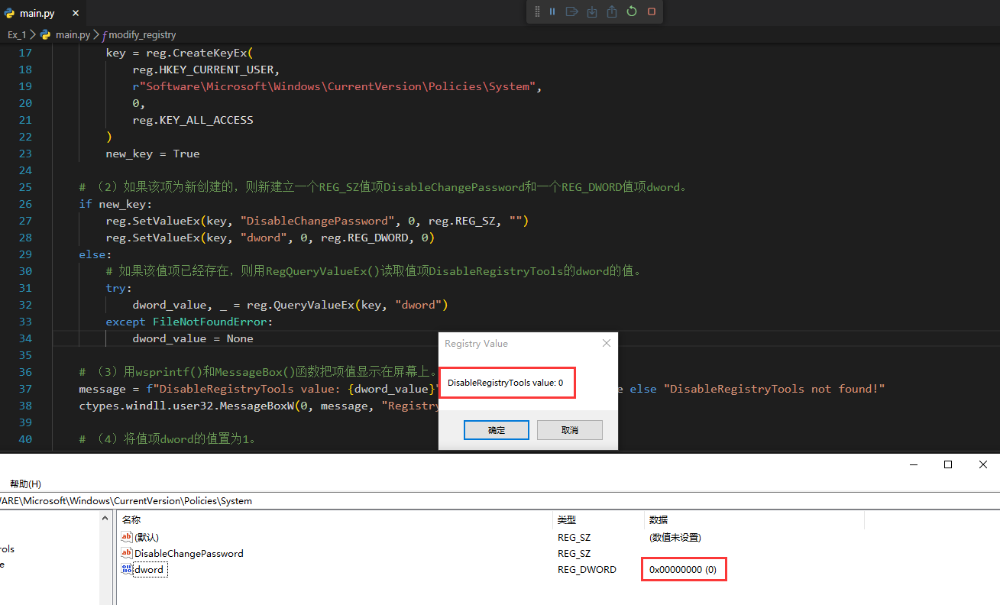
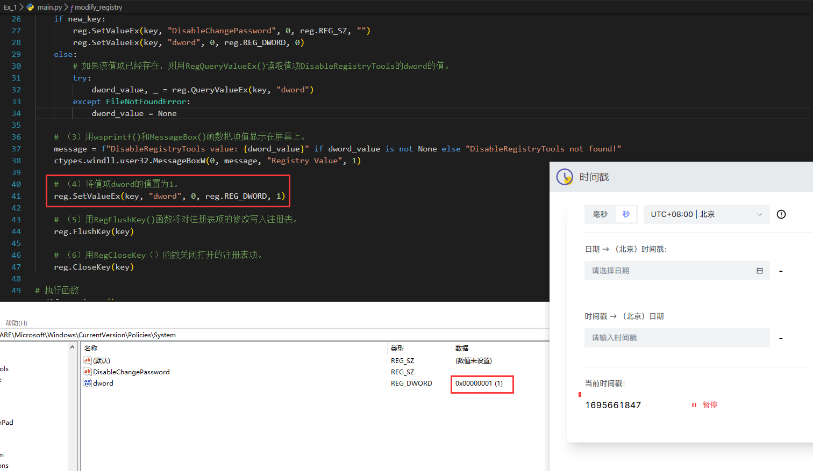

### 前期准备

从实验报告要求中可以看到两个重点：

- 注册表的打开 关闭 创建 修改
- wsprintf() 和 MessageBox() 函数

首先注册表的调用 winreg  模块是肯定的，而另外WindowsAPI wsprintf() 和 MessageBox() 函数 则需要使用 ctypes 模块进行调用。

对于这两个模块的使用，可以在官网上找到对应的文档，如下：

- [winreg](https://docs.python.org/zh-cn/3/library/winreg.html) 

- [ctypes ](https://docs.python.org/zh-cn/3/library/ctypes.html)

### 编写代码

```python
import winreg as reg
import ctypes
```

用RegOpenKeyEx() 函数打开注册表项

`HKEY_CURRENT_USER\Software\Microsoft\Windows\Currest Version\Policies\System`

如果该注册表项不存在，则用RegCreateKeyEx() 函数创建该项

```
winreg.OpenKeyEx(key, sub_key, reserved=0, access=KEY_READ)
打开指定的注册表键，返回 handle对象。
key 为某个已经打开的键，或者预定义的 HKEY_* 常量 之一。
sub_key 是个字符串，标识了需要打开的子键。
reserved 是个保留整数，必须为零。默认值为零。
access 是个指定访问掩码的整数，掩码描述了注册表键所需的安全权限。 默认值为 KEY_READ。 其他合法值参见 访问权限。
返回结果为一个新句柄，指向指定的注册表键。
如果调用失败，则会触发 OSError 。
触发 审计事件 winreg.OpenKey，附带参数为 key 、sub_key 、 access。
引发一个 审计事件 winreg.OpenKey/result，附带参数 key。
在 3.2 版更改: 允许使用命名参数。
在 3.3 版更改: 参考 上文。
```

---

```
winreg.CreateKeyEx(key, sub_key, reserved=0, access=KEY_WRITE)
创建或打开特定的键，返回一个 handle 对象。
key 为某个已经打开的键，或者预定义的 HKEY_* 常量 之一。
sub_key 是用于命名该方法所打开或创建的键的字符串。
reserved 是一个保留的整数，必须是零。 默认值为零。
access 为一个整数，用于给键的预期安全访问指定访问掩码。默认值为 KEY_WRITE。 参阅 Access Rights 了解其它允许值。
如果 key 是预定义键之一，sub_key 可能会是 None。该情况下，返回的句柄就是传入函数的句柄。
如果键已经存在，则该函数打开已经存在的该键。
返回值是所开打键的句柄。如果函数失败，则引发一个 OSError 异常。
引发一个 审计事件 winreg.CreateKey，附带参数 key, sub_key, access。
引发一个 审计事件 winreg.OpenKey/result，附带参数 key。
3.2 新版功能.
在 3.3 版更改: 参考 上文。
```

代码编写如下：

```python
def modify_registry():

    # 初始化值项dword的值为None。
    dword_value = None

    # 用RegOpenKeyEx() 函数打开注册表项:
    try:
        key = reg.OpenKeyEx(
            reg.HKEY_CURRENT_USER,
            r"Software\Microsoft\Windows\CurrentVersion\Policies\System",
            0,
            reg.KEY_ALL_ACCESS
        )
        print("项 DisableRegistryTools 已经存在!")
        new_key = False # 因为后面需要看项是不是存在 所以这里放置标识符
    except FileNotFoundError:
        # 如果该注册表项不存在，则用RegCreateKeyEx() 函数创建该项。
        key = reg.CreateKeyEx(
            reg.HKEY_CURRENT_USER,
            r"Software\Microsoft\Windows\CurrentVersion\Policies\System",
            0,
            reg.KEY_ALL_ACCESS
        )
        print("项 DisableRegistryTools 不存在，已经创建!")
        new_key = True
```

如果该项为新创建的，则新建立一个REG_SZ值项DisableChangePassword和一个REG_DWORD值项dword，参考部分如下：

首先是项的创建 / 修改

```
winreg.SetValueEx(key, value_name, reserved, type, value)
将数据存入已打开的注册表键的值中。
key 为某个已经打开的键，或者预定义的 HKEY_* 常量 之一。
value_name 是个字符串，用于命名与值相关的子键。
reserved 可以是任意数据 —— 传给 API 的总是 0。
type 是个整数，用于指定数据的类型。请参阅 Value Types 了解可用的类型。
value 是设置新值的字符串。
本方法也可为指定的注册表键设置额外的值和类型信息。注册表键必须已用 KEY_SET_VALUE 方式打开。
请用 CreateKey() 或 OpenKey() 方法打开注册表键。
值的长度受到可用内存的限制。较长的值（超过 2048 字节）应存为文件，并将文件名存入配置注册表。这有助于提高注册表的使用效率。
触发 审计事件 winreg.SetValue，附带参数 key、 sub_key 、 type 、 value。
```

项数值的读取

```
winreg.QueryValueEx(key, value_name)
读取已打开注册表键指定值名称的类型和数据。
key 为某个已经打开的键，或者预定义的 HKEY_* 常量 之一。
value_name 是字符串，表示要查询的值。
结果为二元组：
```

| 索引 | 含意                                                         |
| :--- | :----------------------------------------------------------- |
| `0`  | 注册表项的值。                                               |
| `1`  | 整数值，给出该值的注册表类型（请查看文档中的表格了解 [`SetValueEx()`](https://docs.python.org/zh-cn/3/library/winreg.html#winreg.SetValueEx) ）。 |

```
触发 审计事件 winreg.QueryValue，附带参数为 key、 sub_key 、 value_name。
```

所以代码编写如下

```python
    # 如果该项为新创建的，则新建立一个REG_SZ值项DisableChangePassword和一个REG_DWORD值项dword。
    if new_key:
        reg.SetValueEx(key, "DisableChangePassword", 0, reg.REG_SZ, "")
        reg.SetValueEx(key, "dword", 0, reg.REG_DWORD, 0)
    else:
        # 如果该值项已经存在，则用RegQueryValueEx() 读取值项DisableRegistryTools的dword的值。
        try:
            dword_value, _ = reg.QueryValueEx(key, "dword")
        except FileNotFoundError:
            dword_value = None
```

用wsprintf() 和 MessageBox() 函数把项值显示在屏幕上。

这里需要用到除开注册表外的 WindowsAPI 所以使用ctypes去调用windll

```
wsprintf() 是 Windows API 中的一个函数，用于格式化和生成字符串。它类似于 C 语言中的 sprintf()，但它是 Windows 特定的并且支持宽字符（即 Unicode 字符串）。wsprintf() 函数的 "w" 前缀表示它是该函数的宽字符版本。
该函数的主要用途是将多个字符串或变量组合成一个格式化的输出字符串。
```

但笔者觉得这里不是什么重点，所以也没在源码里用 wsprintf() 只是用了 MessageBox()  因为 Python 的字符串处理功能已经遥遥领先了。

代码编写如下：

```python
    # 用wsprintf() 和MessageBox() 函数把项值显示在屏幕上。
    message = f"项 DisableRegistryTools 的值: {dword_value}" if dword_value is not None else "项 DisableRegistryTools 未找到或未设置!"
    ctypes.windll.user32.MessageBoxW(0, message, "注册表值", 1)

    # 将值项dword的值置为1。
    reg.SetValueEx(key, "dword", 0, reg.REG_DWORD, 1)

    # 用RegFlushKey() 函数将对注册表项的修改写入注册表。
    reg.FlushKey(key)

    # 用RegCloseKey() 函数关闭打开的注册表项。
    reg.CloseKey(key)
```

当然，如果你要严格按照实验报告去使用 wsprintf() 的话：

```python
	# 用wsprintf() 和MessageBox() 函数把项值显示在屏幕上。
    wsprintf = ctypes.windll.user32.wsprintfW
    wsprintf.argtypes = [ctypes.c_wchar_p, ctypes.c_wchar_p, ctypes.c_void_p]
    wsprintf.restype = ctypes.c_int

    buffer = ctypes.create_unicode_buffer(256)
    if dword_value is not None:
        format_string = "项 DisableRegistryTools 的值: %d"
        wsprintf(buffer, format_string, dword_value)
    else:
        format_string = "项 DisableRegistryTools 未找到或未设置!"
        wsprintf(buffer, format_string)

    ctypes.windll.user32.MessageBoxW(0, buffer, "注册表值", 1)
```

### 运行代码

要注意，对注册表的操作属于高权限敏感操作，需要使用管理员权限，且可能会被杀毒软件拦截。

完整代码如下：

```python
import winreg as reg
import ctypes

def modify_registry():

    # 初始化值项dword的值为None。
    dword_value = None

    # 用RegOpenKeyEx() 函数打开注册表项:
    try:
        key = reg.OpenKeyEx(
            reg.HKEY_CURRENT_USER,
            r"Software\Microsoft\Windows\CurrentVersion\Policies\Test",
            0,
            reg.KEY_ALL_ACCESS
        )
        print("项 DisableRegistryTools 已经存在!")
        new_key = False
    except FileNotFoundError:
        # 如果该注册表项不存在，则用RegCreateKeyEx() 函数创建该项。
        key = reg.CreateKeyEx(
            reg.HKEY_CURRENT_USER,
            r"Software\Microsoft\Windows\CurrentVersion\Policies\Test",
            0,
            reg.KEY_ALL_ACCESS
        )
        print("项 DisableRegistryTools 不存在，已经创建!")
        new_key = True

    # 如果该项为新创建的，则新建立一个REG_SZ值项DisableChangePassword和一个REG_DWORD值项dword。
    if new_key:
        reg.SetValueEx(key, "DisableChangePassword", 0, reg.REG_SZ, "")
        reg.SetValueEx(key, "dword", 0, reg.REG_DWORD, 0)
    else:
        # 如果该值项已经存在，则用RegQueryValueEx() 读取值项DisableRegistryTools的dword的值。
        try:
            dword_value, _ = reg.QueryValueEx(key, "dword")
        except FileNotFoundError:
            dword_value = None
   
    # 用wsprintf() 和MessageBox() 函数把项值显示在屏幕上。
    message = f"项 DisableRegistryTools 的值: {dword_value}" if dword_value is not None else "项 DisableRegistryTools 未找到或未设置!"
    ctypes.windll.user32.MessageBoxW(0, message, "注册表值", 1)

    # 将值项dword的值置为1。
    reg.SetValueEx(key, "dword", 0, reg.REG_DWORD, 1)

    # 用RegFlushKey() 函数将对注册表项的修改写入注册表。
    reg.FlushKey(key)

    # 用RegCloseKey() 函数关闭打开的注册表项。
    reg.CloseKey(key)

# 执行函数
modify_registry()

```










### 一些彩蛋

- 注释掉 RegFlushKey() 后 运行程序 依旧能够正常修改值

  ```
  RegFlushKey()函数的主要目的是将指定的注册表键中的所有属性从内存中写入磁盘。Windows操作系统通常会缓存对注册表的更改，并在适当的时候自动将它们写入磁盘。所以，即时没有显式调用RegFlushKey()，更改仍然会在某个时候自动保存。
  使用RegFlushKey()的主要好处是它确保对注册表的所有更改都立即写入磁盘，而不是依赖系统的自动缓存和写入机制。这在某些情况下可能很有用x
  但是，在许多常见的使用场景中，不调用RegFlushKey()也是可以的，因为操作系统会在合适的时机处理缓存的数据并将其写入磁盘。
  ```

### 总结

- **RegOpenKeyEx()**:
   - 用于打开指定的注册表项。
   - 如果该项不存在，此函数会抛出一个`FileNotFoundError`异常。
- **RegCreateKeyEx()**:
   - 当指定的注册表项不存在时，此函数用于创建新的注册表项。
   - 它返回一个新的注册表键句柄。
- **RegSetValueEx()**:
   - 用于在指定的注册表键下创建或修改一个值。
   - 它可以设置各种类型的值，例如`REG_SZ`（字符串）和`REG_DWORD`（32位数）。
- **RegQueryValueEx()**:
   - 用于查询指定的注册表键下的一个值。
   - 它返回该值的数据和类型。
- **RegFlushKey()**:
   - 用于将对注册表项的所有更改从内存中立即写入磁盘。
   - 在没有此函数的情况下，Windows可能会延迟写入，直到它认为是适当的时候。
- **RegCloseKey()**:
   - 用于关闭打开的注册表键句柄。
   - 一旦使用完句柄，就应该关闭它以释放资源。
- **ctypes.windll.user32.MessageBoxW**:
   - 用于显示一个Windows消息框。
   - 这是直接从user32.dll库调用的Windows API函数。

